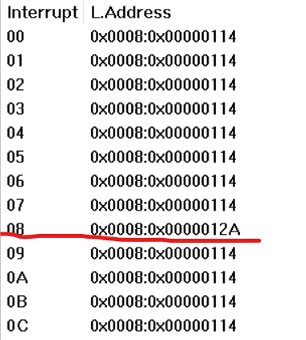
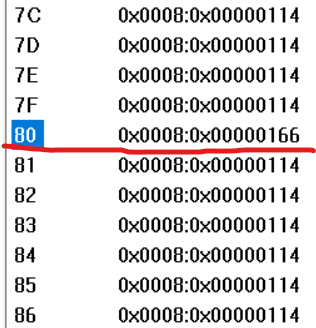
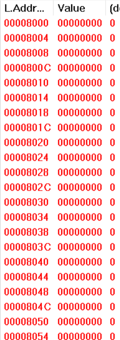
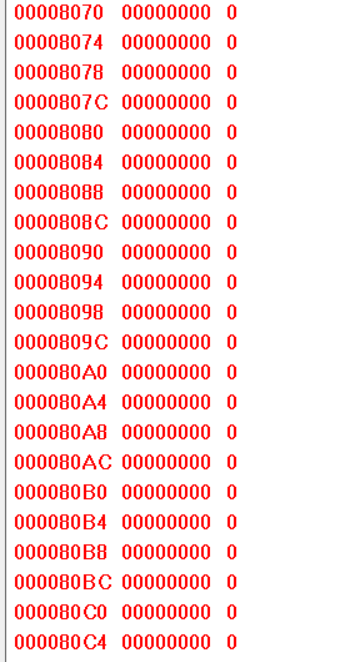

# 实验一
通过仔细的调试与跟踪程序，完成以下任务：
### (1)请简述 head.s 的工作原理
&emsp;&emsp;head.s 包含 32 位保护模式**初始化设置代码、三种种类的中断代码和两个任务的代码**。在初始化完成之后程序移动到任务 0 开始执行，并在时钟中断控制下进行任务 0 和 1 之间的切换操作。
head.s 开始执行，它的主要任务是设置一个适当的环境，以准备加载操作系统内核。这通常涉及到以下几个步骤：

1. 初始化 GDT/IDT和各类寄存器
2. 设置系统定时器芯片 8253
3. 初始化 TSS
4. 跳转到task0 的用户态程序
5. task0 或 task1 的用户态程序在运行时，通过系统调用 int 0x80 向屏幕上打印字符A或B
6. 时钟中断发生时，内核的中断处理程序实现task0 和task1 的任务切换 

下面将分模块简介。
#### 初始化设置代码
&emsp;&emsp;head.s首先初始化定时器数值和各类段选择符如下：
<div>			<!--块级封装-->
    <center>	<!--将图片和文字居中-->
    
    <!--标题-->
    </center>
</div> 
&emsp;&emsp;然后在startup_32代码段初始化各类资源。首先加载数据段寄存器DS，堆栈段寄存器SS和堆栈指针ESP。所有段的线性基地址都是0。核心代码及注释如下：

```
movl $0x10,%eax # 0x10 是 GDT 中数据段选择符。将段选择符给eax寄存器，可在GDT中查询
mov %ax,%ds     #将低8位交给ds
lss init_stack,%esp    #把 stack_start这个地址的高16位给ss，低16位给esp
```

&emsp;&emsp;然后代码设置IDT和GDT表，通过`call setup_idt`和`call setup_gdt`两句调用相关代码段来设置IDT和GDT。同时在改变了GDT后重新加载所有段寄存器。设置GDT后结果如下图所示：
<div>			<!--块级封装-->
    <center>	<!--将图片和文字居中-->
    
    <!--标题-->
    </center>
</div> 

&emsp;&emsp;设置完后设置 8253 定时芯片。把计数器通道 0 设置成每隔 10 毫秒向中断控制器发送一个中断请求信号。用于后续触发中断。设置代码如下：
<div>			<!--块级封装-->
    <center>	<!--将图片和文字居中-->
    
    <!--标题-->
    </center>
</div> 
其中控制字 0x36 是用于设置 8253 芯片的。这个控制字的含义如下：

- `0x36` 是一个 8 位的二进制数，其二进制表示为 `0011 0110`。
- 这个控制字的各个位的含义如下：
    * 第 7-6 位（`00`）：选择通道 0。
    * 第 5-4 位（`11`）：选择读写模式，`11` 表示先读写低字节，再读写高字节。
    * 第 3-1 位（`011`）：设置工作模式为方式 3，也被称为方波发生器模式。在这种模式下，计数器会自动重复计数，并输出对称的方波。
    * 第 0 位（`0`）：设置计数初值采用二进制。

因此，控制字 `0x36` 的含义是：选择通道 0，先读写低字节再读写高字节，设置工作模式为方式 3，并且计数初值采用二进制。

&emsp;&emsp;当一个中断发生时，处理器会使用中断向量号作为索引，从中断描述符表（IDT）中找到相应的中断门描述符，然后根据描述符中的信息找到并执行相应的中断处理程序。为了实现中断处理，在IDT表第 8 和第 128（0x80）项处分别设置定时中断门描述符和系统调用陷阱门描述符。具体代码和注释如下：
```
movl $0x00080000, %eax # 中断程序属内核，即 EAX 高字是内核代码段选择符 0x0008。
movw $timer_interrupt, %ax # 设置定时中断门描述符。取定时中断处理程序地址。
movw $0x8E00, %dx # 中断门类型是 14（屏蔽中断），特权级 0 或硬件使用。
movl $0x08, %ecx # 开机时 BIOS 设置的时钟中断向量号 8。这里直接使用它。
lea idt(,%ecx,8), %esi # 把 IDT 描述符 0x08 地址放入 ESI 中，然后设置该描述符。
movl %eax,(%esi) 
movl %edx,4(%esi)
```

&emsp;&emsp;需要特别注意和说明的是：`$0x00080000`里的8转化二进制为1000，后两位00表示在内核模式下，第三位0表示访问GDT，1则表示访问IDT第一项。说明是在内核模式下将GDT表的第一项给eax寄存器。

&emsp;`$0x8E00` 在这里被用作中断门描述符的属性。这个属性值的含义如下：
- `0x8E00` 是一个 16 位的二进制数，其二进制表示为 `1000 1110 0000 0000`。
- 这个属性值的各个位的含义如下：
    * 第 15 位（`1`）：表示描述符是在 GDT 中还是在 LDT 中。`1` 表示在 GDT 中。
    * 第 14-13 位（`00`）：表示描述符类型。对于系统段，`00` 表示未使用的描述符类型。
    * 第 12 位（`1`）：表示描述符存在位。`1` 表示描述符在内存中存在。
    * 第 11-8 位（`1110`）：表示门类型。对于系统段，`1110` 表示中断门类型为14。
    * 第 7-5 位（`000`）：未使用，应设置为 `0`。
    * 第 4-0 位（`00000`）：未使用，应设置为 `0`。
因此，属性值 `0x8E00` 的含义是：描述符在 GDT 中，是一个存在的、14类型的中断门

&emsp;&emsp;`$0x08` 是一个十六进制数，它的十进制表示为 8。这个值被用作中断向量号，中断向量号是用于在中断描述符表（IDT）中索引中断门描述符的值。
`movl %eax,(%esi)`将eax赋值给esi所指的地址中，同时将`movl %edx,4(%esi)`赋值给esi偏移4个字节的地方。设置完的结果如下图所示：

<center class="half">


</center>

&emsp;&emsp;在设置完以上资源后，移动到任务 0（任务 A）中执行来操作堆栈内容，在堆栈中人工建立中断返回时的场景。先将EFLAGS中的NT标志位复位(由1到0)，然后加载TR和LDTR(只需加载一次，后面cpu会自动加载)，在将任务0保存在current变量后开启中断，后将数据段，堆栈指针，标志寄存器，代码选择符，代码指针入栈。

#### 中断处理程序
&emsp;&emsp;head.s一共设计了三种中断处理程序：**默认中断、定时中断和系统调用中断**。
&emsp;&emsp;ignore_int是默认的中断处理程序，若系统产生了其他中断，则会在屏幕上显示一个字符'C'。具体运行是通过`movl $0x10,%eax`首先让DS指向内核数据段，然后在AL中存放字符‘C’的代码，调用显示程序显示在屏幕上。
&emsp;&emsp;timer_interrupt是定时中断处理程序，其主要执行切换操作。同样首先让DS指向内核数据段，然后立刻允许其他硬件中断，即向8259A发送EOI(end of interrupt)命令，接着判断当前任务，若是任务 1 则去执行任务 0，或反之。若当前任务是 0，则把 1 存入 current，并跳转到任务1。若当前任务是1，则把0存入current，并跳转到任务 0。代码如下：
```
118 timer_interrupt:
119 push %ds        #119和120两句用于保存当前状态
120 pushl %eax
121 movl $0x10, %eax # 首先让 DS 指向内核数据段。
122 mov %ax, %ds     #将 DS 寄存器设置为内核数据段的选择子。
123 movb $0x20, %al # 然后立刻允许其他硬件中断，即向 8259A 发送 EOI 命令。
124 outb %al, $0x20
125 movl $1, %eax # 接着判断当前任务，若是任务 1 则去执行任务 0，或反之。
126 cmpl %eax, current
127 je 1f
128 movl %eax, current # 若当前任务是 0，则把 1 存入 current，并跳转到任务 1
129 ljmp $TSS1_SEL, $0 # 去执行。注意跳转的偏移值无用，但需要写上。
130 jmp 2f
131 1: movl $0, current # 若当前任务是 1，则把 0 存入 current，并跳转到任务 0
132 ljmp $TSS0_SEL, $0 # 去执行。
133 2: popl %eax        #弹出eax和ds，恢复之前保存的状态。
134 pop %ds
135 iret
```

&emsp;&emsp;system_interrupt是系统调用中断int 0x80处理程序。该程序只显示字符。先将ds,edx,ecx,ebx,eax放入堆栈，再让DS指向内核数据段。然后调用显示字符子程序write_char，显示AL中的字符。最后再弹出eax,ebx,ecx,edx,ds寄存器。重点代码段如下所示：
```
145 movl $0x10, %edx # 首先让 DS 指向内核数据段。
146 mov %dx, %ds
147 call write_char # 然后调用显示字符子程序 write_char，显示 AL 中的字符。
```

#### 任务代码段
&emsp;&emsp;任务代码段分为任务0和任务1，他们分别循环显示字符‘A’和‘B’。以任务0代码进行简单说明。
<div>			<!--块级封装-->
    <center>	<!--将图片和文字居中-->
    
    <!--标题-->
    </center>
</div> 
&emsp;&emsp;在处理时首先让DS指向任务的局部数据段，此时需注意的是局部数据段从0x17开始，然后把需要显示的字符‘A’放入AL寄存器中。此外执行系统调用，显示字符。将0xfff给ecx起延时作用，将ECX寄存器的值减1，然后检查ECX寄存器的值是否为0。如果ECX寄存器的值不为0，那么跳转到标签1b所在的位置继续执行。如果 ECX 寄存器的值为0，那么就继续执行下一条指令。延时完成后跳转到任务代码开始处继续显示字符。任务1的执行过程同任务同任务0。

### (2)请记录 head.s 的内存分布状况，写明每个数据段，代码段，栈段的起始与终止的内存地址
head.s内存分布状况直观如下图所示：
<div>			<!--块级封装-->
    <center>	<!--将图片和文字居中-->
    
    <!--标题-->
    </center>
</div>

#### 数据段、代码段
&emsp;&emsp;代码段（text segment）：引导加载程序的机器代码，通常位于内存的低地址
&emsp;&emsp;数据段（data segment）：引导加载程序的数据和全局变量，可能位于代码段的下方
&emsp;&emsp;点击GDT查看全局描述符表 (GDT) 的内容如下：
<div>			<!--块级封装-->
    <center>	<!--将图片和文字居中-->
    
    <!--标题-->
    </center>
</div>

- Selector 0x0008 通常用于访问操作系统内核的代码段
- Selector 0x0010 通常用于访问操作系统内核的数据段

从图中可见数据段和代码段的起始地址都是0x0，Size为0x7FFFFF,终止地址=起始地址+Size。**故数据段和代码段的其实地址为0x0,终止地址为0x7FFFFF**。
#### 栈段
栈段（stack segment）：用于函数调用和本地变量。通常在数据段的上方。点击stack按钮进行查看。
<center class="half">


</center>

可见**起始位置为0x8000，终止位置为0x80C4+4-1=0x80C7**

### (3)简述 head.s 57 至 62 行在做什么？
head.s 57至62行代码如下：
<div>			<!--块级封装-->
    <center>	<!--将图片和文字居中-->
    
    <!--标题-->
    </center>
</div>


- `pushl $0x17`：这行代码将任务 0 的当前局部数据段（也就是堆栈段）的选择符压入堆栈。`0x17` 是这个选择符的值。
  0x17表示选择符的值，展开二进制位00010111，段选择符结构如下所示
  <div>			<!--块级封装-->
    <center>	<!--将图片和文字居中-->
    
    <!--标题-->
    </center>
  </div>
  则表示其为用户模式下LDT的第三项，对应LDT之前在0x17的赋值。

  ```
  185 .align 3
  186 ldt0: .quad 0x0000000000000000 # 第 1 个描述符，不用。
  187       .quad 0x00c0fa00000003ff # 第 2 个局部代码段描述符，对应选择符是 0x0f。可读
  188       .quad 0x00c0f200000003ff # 第 3 个局部数据段描述符，对应选择符是 0x17。
  ```
- `pushl $init_stack`：这行代码将堆栈指针压入堆栈。`init_stack` 是堆栈指针的值。也可以直接将 ESP 寄存器的值压入堆栈，这里压入00000bd8。
- `pushfl`：这行代码将标志寄存器的值压入堆栈。
- `pushl $0x0f`：这行代码将当前局部空间的代码段选择符压入堆栈。`0x0f` 是这个选择符的值,`0x0f`展开为00001111，表示用户模式下取LDT的第2项。
- `pushl $task0`：这行代码将代码指针压入堆栈。`task0` 是代码指针的值。
  上述代码入栈运行后结果如下图所示：
    <div>			<!--块级封装-->
    <center>	<!--将图片和文字居中-->
    
    <!--标题-->
    </center>
  </div>
- `iret`：这行代码执行中断返回指令，从而切换到特权级 3 的任务 0 中执行。
  会发现这里iret之后栈未发生变化，是因为初始堆栈就是task0的用户栈。在执行后代码进入用户模式开始运行。

总的来说，这段代码通过设置正确的段选择符和堆栈指针，然后使用 `iret` 指令来实现任务切换。

### (4)简述 iret 执行后，pc如何找到下一条指令？

&emsp;&emsp;iret 指令用于从中断处理程序返回到正常的程序执行。iret 指令的执行后，处理器会进行下一跳指令的查找和执行，如下图所示，可见pc跳转到000010e0，是task0的入口地址。下面是其执行后寻找下一跳指令的过程：
<div>			<!--块级封装-->
    <center>	<!--将图片和文字居中-->
    
    <!--标题-->
    </center>
</div>

- iret 恢复寄存器状态：iret 指令会从栈中弹出一系列值，包括代码段选择符（CS）、代码指针（EIP）、标志寄存器（EFLAGS），以及堆栈指针（ESP）的值。这些值都是在中断处理过程中被保存的，用于恢复中断前的状态。

- 加载代码段选择符（CS）：iret 指令将代码段选择符（CS）从栈中加载到 CS 寄存器中。CS 寄存器包含了新的代码段选择符，它指示了中断返回后应执行的代码段。

- 加载代码指针（EIP）：iret 指令将代码指针（EIP）从栈中加载到 EIP 寄存器中。EIP 寄存器包含了下一条要执行的指令的地址。

- 加载标志寄存器（EFLAGS）：iret 指令将标志寄存器（EFLAGS）从栈中加载到 EFLAGS 寄存器中。这些标志用于控制处理器的状态和行为。

- 堆栈指针（ESP）的修改：iret 指令还会从栈中弹出堆栈指针（ESP）的值。这是为了确保栈指针正确地指向下一个栈帧。

- 执行下一跳指令：一旦 iret 执行完上述步骤，控制将传递到新的代码段（由 CS 指定）中的新指令（由 EIP 指定）。处理器将从新代码段的新指令地址开始执行，从而继续程序的正常执行，即继续执行任务0的程序。

### (5)记录 iret 执行前后，栈是如何变化的？
#### iret执行前
在执行 iret 指令之前，堆栈中包含了堆栈段选择符、堆栈指针、标志寄存器、代码段选择符和代码指针。
<div>			<!--块级封装-->
    <center>	<!--将图片和文字居中-->
    
    <!--标题-->
    </center>
</div>

#### iret执行后
<div>			<!--块级封装-->
    <center>	<!--将图片和文字居中-->
    
    <!--标题-->
    </center>
</div>

iret 指令的目的是从中断处理程序返回到正常程序执行，它会恢复堆栈指针、代码段选择符、代码指针、标志寄存器等寄存器的值，以确保程序的控制流和状态正确地切换到正常程序。

因此当执行 iret 后，堆栈的变化如下：
1. iret 指令会弹出之前被压入栈的值，以恢复任务 0 的状态。
   - iret 弹出代码指针（EIP）的值，指示了下一条要执行的指令地址。
   - 然后它弹出代码段选择符（CS），指示了代码段的位置。
   - 接着，它弹出标志寄存器（EFLAGS）的值，以恢复标志状态。
   - 最后，它弹出堆栈指针（ESP）的值，以确保栈指针正确指向下一个栈帧。
2. iret 将控制传递到任务 0 中的下一条指令，以继续程序的正常执行。

### (6)当任务进行系统调用时，即 int 0x80 时，记录栈的变化情况。
#### 执行int 0x80前
&emsp;&emsp;当任务 0 希望执行系统调用时，它会将系统调用号和相关显示的值65(‘A’)加载到寄存器中。寄存器中的内容，包括系统调用号和参数，通常在进入内核前被保存在寄存器中。栈上包含了任务 0 正常执行的栈帧，包括函数调用的参数、局部变量等
<div>			<!--块级封装-->
    <center>	<!--将图片和文字居中-->
    
    <!--标题-->
    </center>
</div>

#### 执行int 0x80后
<div>			<!--块级封装-->
    <center>	<!--将图片和文字居中-->
    
    <!--标题-->
    </center>
</div>
从图中可见当任务 0触发 int $0x80 指令时，处理器会执行以下操作：

- 压入标志寄存器（EFLAGS）的值(00000246)。
- 压入代码段选择符（CS）的值(0000000f)。
- 压入返回地址，指向系统调用处理程序(000010eb)。
- 压入数据段选择符(00000017)。
- 压入堆栈指针(00000bd8)

&emsp;&emsp;进入内核态后，内核会根据系统调用号，从栈上获取参数，执行相应的系统调用服务。系统调用处理程序执行完后，它会将返回值存储在一个特定的寄存器中，通常是 EAX 寄存器。处理程序使用 iret 指令返回到用户态，这会将栈上的内容弹出，恢复到 int $0x80 指令执行前的状态。


